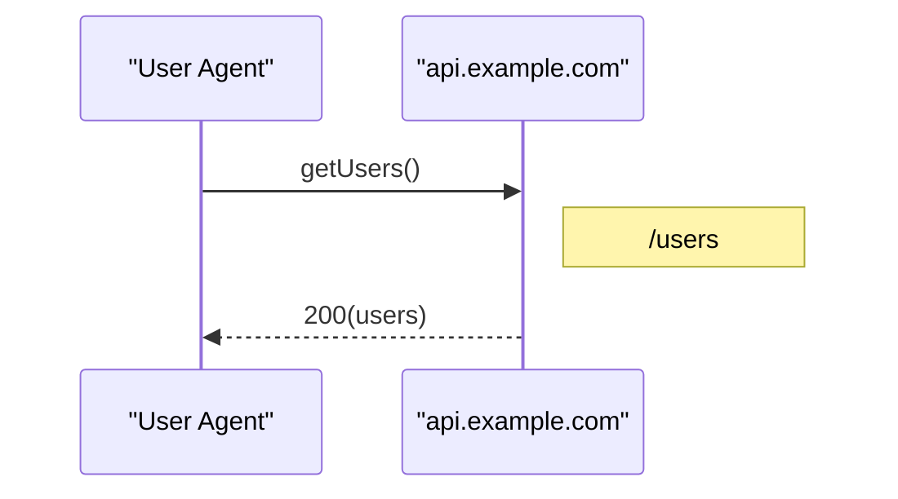

# har-to-mermaid

A library to generate Mermaid sequence diagrams from HAR (HTTP Archive) files.

## Installation

```bash
npm install har-to-mermaid
```

## Usage

### Synchronous

```javascript
var h2m = require('har-to-mermaid');

var harLog = {
  entries: [
    {
      request: {
        method: 'GET',
        url: 'https://api.example.com/users'
      },
      response: {
        status: 200,
        statusText: 'OK'
      }
    }
  ]
};

var mermaidText = h2m.generate(harLog);
console.log(mermaidText);
```

### Asynchronous

```javascript
var h2m = require('har-to-mermaid');

h2m.generateAsync(harLog, function(err, result) {
  if (err) {
    console.error('Error:', err);
  } else {
    console.log(result.mermaid);
  }
});
```

## API

### `generate(harLog, options)`

Synchronously generates a Mermaid sequence diagram from a HAR log object.

**Parameters:**
- `harLog` (Object): HAR log object with an `entries` array
- `options` (Object, optional): Configuration options (reserved for future use)

**Returns:**
- `String`: Mermaid sequence diagram text

**Throws:**
- `Error`: If the HAR log is invalid or missing required fields

### `generateAsync(harLog, callback, options)`

Asynchronously generates a Mermaid sequence diagram from a HAR log object.

**Parameters:**
- `harLog` (Object): HAR log object with an `entries` array
- `callback` (Function): Callback function `(err, result)`
  - `err` (Error|null): Error object if generation failed
  - `result` (Object): Result object with `mermaid` property containing the diagram text
- `options` (Object, optional): Configuration options (reserved for future use)

## HAR Format

The library expects a HAR log object with the following structure:

```javascript
{
  entries: [
    {
      request: {
        method: 'GET',
        url: 'https://api.example.com/users',
        queryString: [
          { name: 'page', value: '1' }
        ]
      },
      response: {
        status: 200,
        statusText: 'OK'
      },
      'x-service-name': 'API Server',  // Optional: custom service name
      'x-resource-name': 'users'       // Optional: custom resource name
    }
  ]
}
```

## Output

The library generates Mermaid sequence diagrams showing:
- User Agent as the initial participant
- Services extracted from HAR entries (by hostname or path)
- Request/response sequences with HTTP methods and status codes
- Query and path parameters
- URL path notes

Example output:



## License

MIT

## Author

Gregory Buchenberger

## Repository

https://github.com/buchenberg/har-to-mermaid

